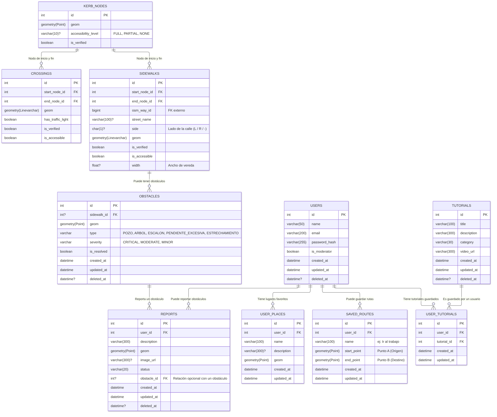
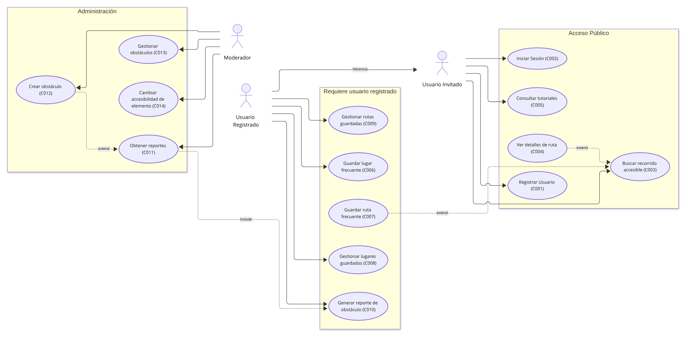
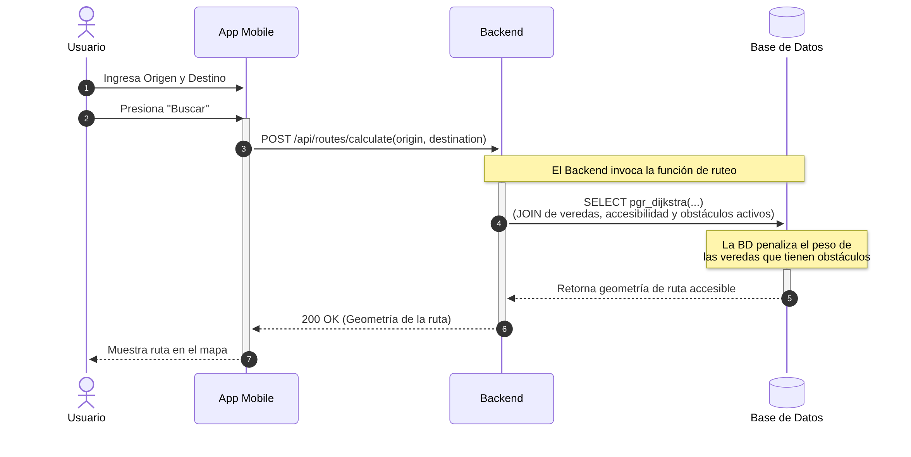
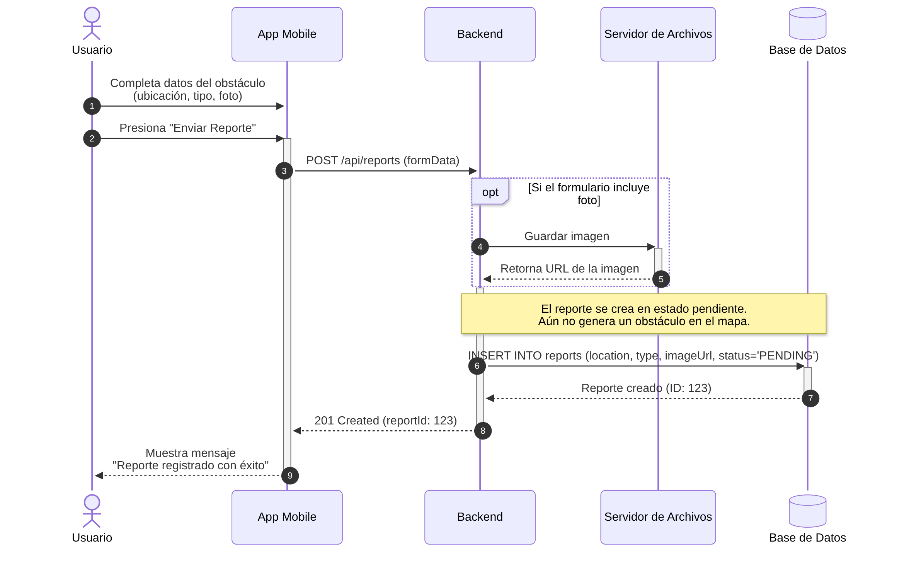
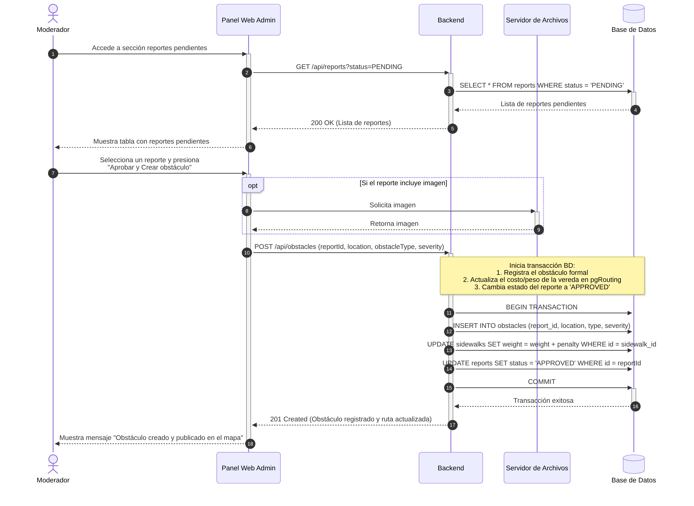

# Diagramas del Proyecto

> Documento temático. Describe cómo se crean, se guardan y se generan los
> diagramas del proyecto. Se complementa con
> [00-reglas-documentacion.md](00-reglas-documentacion.md), que define las reglas
> generales de la documentación.

## 1. Por qué mermaid

Todos los diagramas se escriben en [Mermaid](https://mermaid.js.org/) y se
guardan como archivos `.mmd` en `docs/diagrams/`. La elección se basa en tres
razones:

- **Simpleza**: el diagrama es texto plano en un formato compacto. No hace falta
  una herramienta gráfica ni archivos binarios para editarlo.
- **Resultados**: el render es limpio y consistente, adecuado para documentación.
- **Seguimiento de versiones con git**: al ser texto, cada cambio aparece en el
  diff, se revisa como código y se puede revertir. Las imágenes generadas se
  incluyen en el repositorio para poder verlas sin herramientas adicionales.

## 2. Requisito: mermaid 12

Los diagramas se renderizan con la **librería mermaid 12**. Esto es importante:
el diagrama de casos de uso usa la sintaxis `usecase-beta`, que **solo existe
desde mermaid 12.0.0**. En versiones anteriores no funciona.

Atención a la versión del CLI: el `@mermaid-js/mermaid-cli` más reciente es
**11.17.0** e incluye mermaid 11.17.2. No existe todavía un CLI 12, así que un
CLI instalado de la forma habitual falla con el diagrama de casos de uso:

| Síntoma | Causa |
| --- | --- |
| `UnknownDiagramError: No diagram type detected matching given configuration for text: usecase-beta` | El CLI usa mermaid 11 |
| `No such shape: usecaseActor` | El layout `@mermaid-js/layout-elk` es 0.2.x |

### Instalación del entorno

El CLI se instala en un directorio propio, con overrides que fuerzan
`mermaid@12.0.0` y `@mermaid-js/layout-elk@1.0.0`:

```sh
mkdir -p ~/.local/share/mmdc12 && cd ~/.local/share/mmdc12
printf '{"name":"mmdc12","private":true}\n' > package.json
printf "packages: []\noverrides:\n  mermaid: 12.0.0\n  '@mermaid-js/layout-elk': 1.0.0\n" > pnpm-workspace.yaml
pnpm add @mermaid-js/mermaid-cli
```

Como el binario queda fuera del `PATH`, se crea un wrapper en
`~/.local/bin/mmdc` (que sí está en el `PATH`):

```sh
#!/bin/sh
exec "$HOME/.local/share/mmdc12/node_modules/.bin/mmdc" "$@"
```

```sh
chmod +x ~/.local/bin/mmdc
```

Si existe un `mmdc` global de pnpm sin overrides, quitarlo para que no gane en el
`PATH`:

```sh
pnpm remove -g @mermaid-js/mermaid-cli
```

El primer render descarga Chromium en `~/.cache/puppeteer` si no está; eso
requiere conexión a internet. Los renders siguientes funcionan sin red.

### Verificación

Renderizar el diagrama de casos de uso:

```sh
mmdc -i docs/diagrams/02-casos_uso.mmd -o /tmp/casos_uso.svg -q
```

Si aparece alguno de los errores de la tabla anterior, el `mmdc` en uso no tiene
mermaid 12.

## 3. Estructura y convenciones

- Documentación: `docs/`
- Diagramas: `docs/diagrams/`, un archivo `.mmd` por diagrama.
- Imágenes generadas: `docs/diagrams/imgs/`
- Herramientas: `scripts/`
- Cada imagen lleva el **mismo nombre base** que su `.mmd`:
  `01-DER.mmd` → `imgs/01-DER.png`.
- Las imágenes **se versionan en git** junto con los `.mmd` (no se ignoran).

| Diagrama | Tipo | Descripción |
| --- | --- | --- |
| `01-DER.mmd` | Entidad-relación | Modelo de la base de datos |
| `02-casos_uso.mmd` | Casos de uso (`usecase-beta`) | Actores y casos de uso C001–C014 |
| `03-seq-C003.mmd` | Secuencia | C003, buscar recorrido accesible |
| `03-seq-C010.mmd` | Secuencia | C010, generar reporte de obstáculo |
| `03-seq-C012.mmd` | Secuencia | C012, crear obstáculo desde un reporte (incluye la consulta de C011) |

## 4. Generación de las imágenes

### Con el script

`scripts/render-diagrams.sh` genera todas las imágenes de una vez. Es
idempotente: se puede ejecutar las veces que haga falta.

```sh
./scripts/render-diagrams.sh              # PNG de todos los diagramas
./scripts/render-diagrams.sh --svg        # SVG (ver §5)
./scripts/render-diagrams.sh --both       # PNG y SVG
./scripts/render-diagrams.sh 02-casos_uso # un solo diagrama (nombre, archivo o ruta)
```

El script verifica que el `mmdc` disponible soporte mermaid 12 antes de generar
(con un diagrama de prueba), avisa si hay imágenes sin `.mmd` asociado y
devuelve un código de error si falla algún render.

### A mano (CLI de mermaid)

Desde `docs/diagrams/`:

```sh
mkdir -p imgs
mmdc -i 01-DER.mmd -o imgs/01-DER.png -s 3
```

Parámetros útiles:

- `-s 3`: escala del render. Para PNG es la opción de calidad: multiplica la
  resolución (un diagrama de 391x171 px se exporta a 1173x513 px). Con 3 alcanza;
  valores mayores agrandan el archivo sin mejora visible.
- `-w` / `-H`: definen el viewport de la página (800x600 por defecto), pero el
  PNG se recorta al diagrama: no cambian el tamaño final.
- `-b transparent`: fondo transparente (por defecto, blanco).
- `-q`: suprime los logs.

## 5. Texto en las exportaciones SVG

El look por defecto de mermaid 12 renderiza las etiquetas como HTML dentro de
`<foreignObject>`. El texto **sí está** en el SVG, pero muchos visores (Loupe,
Inkscape, LibreOffice, previsualizadores) no soportan `foreignObject` y muestran
el diagrama sin textos. Chrome, Firefox y la exportación a PNG no tienen ese
problema.

Para que el SVG tenga `<text>` real y se vea en cualquier visor hay que
desactivar `htmlLabels`. Hay dos formas equivalentes:

**Opción A: front matter en el `.mmd`**

Se agrega al comienzo del archivo (antes del tipo de diagrama):

```mermaid
---
config:
  htmlLabels: false
---
usecase-beta
%% ... resto del diagrama
```

**Opción B: configuración por CLI**

El repositorio incluye `scripts/mermaid-config.json` con el contenido
`{ "htmlLabels": false }`:

```sh
mmdc -i docs/diagrams/02-casos_uso.mmd \
     -o docs/diagrams/imgs/02-casos_uso.svg \
     -c scripts/mermaid-config.json
```

El script de §4 aplica la opción B automáticamente al generar SVG. Esa
configuración cambia levemente el layout, por eso los PNG del repositorio se
generan sin ella.

## 6. Visualización y uso compartido

### Visores externos

El contenido de un `.mmd` se puede copiar y pegar en un visor de mermaid, por
ejemplo <https://mermaid.ai/live/edit> o <https://mermaid.live>. El visor debe
soportar mermaid 12 para el diagrama de casos de uso; uno desactualizado falla
con los errores de §2.

### URL pública desde GitHub

Al subir el repositorio a GitHub, cada imagen queda accesible por una URL que se
puede compartir, por ejemplo:

```
https://raw.githubusercontent.com/<usuario>/<repositorio>/<rama>/docs/diagrams/imgs/01-DER.png
```

- En repositorios privados la URL no es pública.
- La URL apunta a una rama: su contenido cambia cuando cambia la imagen. Para
  citar una versión puntual, reemplazar la rama por el hash del commit.
- GitHub también renderiza bloques mermaid en Markdown, pero su versión puede no
  soportar `usecase-beta`; por eso se comparten las imágenes del repositorio.

## 7. Mantenimiento

Las imágenes pueden quedar desactualizadas respecto de su `.mmd`. Reglas:

- Un cambio en un `.mmd` **no está terminado** hasta regenerar su imagen en el
  mismo commit (ver §6 de [00-reglas-documentacion.md](00-reglas-documentacion.md)).
- Ante la duda de si una imagen está al día, regenerarla: el script es
  idempotente y el resultado es determinista.
- Al agregar o renombrar un diagrama, regenerar todas las imágenes y revisar que
  no queden imágenes huérfanas (el script lo advierte).

## 8. Diagramas actuales

Las imágenes siguientes se incluyen para visualización rápida; ante cualquier
duda, regenerarlas con `./scripts/render-diagrams.sh`.

### Modelo entidad-relación



Fuente: [`01-DER.mmd`](./diagrams/01-DER.mmd)

### Casos de uso



Fuente: [`02-casos_uso.mmd`](./diagrams/02-casos_uso.mmd)

### Secuencia C003: buscar recorrido accesible



Fuente: [`03-seq-C003.mmd`](./diagrams/03-seq-C003.mmd)

### Secuencia C010: generar reporte de obstáculo



Fuente: [`03-seq-C010.mmd`](./diagrams/03-seq-C010.mmd)

### Secuencia C012: crear obstáculo desde un reporte



Fuente: [`03-seq-C012.mmd`](./diagrams/03-seq-C012.mmd)
